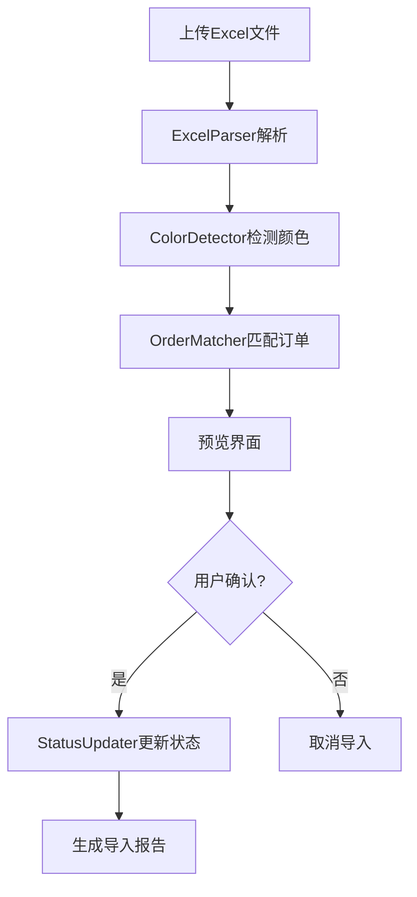

# 设计文档: 财务原始数据导入

## 概述

财务原始数据导入功能是一个一次性数据迁移工具，用于将历史订单的支付状态从带有颜色标记的Excel文件导入到账单系统中。该功能通过解析Excel文件中的单元格背景颜色来识别订单的支付和出账状态，并自动匹配数据库中的订单记录进行状态更新。

### 核心功能

- 解析多Sheet的Excel文件（.xls/.xlsx格式）
- 基于RGB阈值检测单元格背景颜色（蓝色、粉红色、绿色、白色）
- 通过国际单号或用户ID+重量进行订单匹配
- 为历史数据创建特殊账单记录
- 按客户分组的事务管理，确保部分成功机制
- 提供预览界面和手动修正功能
- 生成详细的导入报告

### 设计目标

1. **准确性**: 通过多级匹配策略确保订单匹配的准确性
2. **容错性**: 支持部分成功，单个客户的失败不影响其他客户
3. **可追溯性**: 完整的导入报告和历史记录
4. **用户友好**: 提供预览和手动修正功能，降低错误风险

## 架构

### 整体架构

系统采用经典的MVC架构，结合服务层模式：

```
Controller (PaymentImport.php)
    ↓
Service Layer (PaymentImportService.php)
    ↓
Model Layer (Package.php, Statement.php)
    ↓
Database (inpack, statement)
```

### 服务层组件

PaymentImportService 是核心服务类，包含以下子组件：

1. **ExcelParser**: Excel文件解析器
2. **ColorDetector**: 颜色检测器
3. **OrderMatcher**: 订单匹配器
4. **StatusUpdater**: 状态更新器

### 数据流



## 组件和接口

### 1. PaymentImportService

核心服务类，协调所有子组件。

```php
class PaymentImportService
{
    private $wxappId;
    
    /**
     * 解析Excel文件
     * @param string $filePath 文件路径
     * @return array 解析结果
     */
    public function parseExcelFile($filePath);
    
    /**
     * 执行导入
     * @param array $previewData 预览数据
     * @param array $userCorrections 用户修正数据
     * @return array 导入报告
     */
    public function executeImport($previewData, $userCorrections);
    
    /**
     * 生成预览数据
     * @param array $parsedData 解析后的数据
     * @return array 预览数据
     */
    public function generatePreview($parsedData);
}
```

### 2. ExcelParser (内部组件)

负责读取Excel文件并提取数据。

```php
/**
 * 解析Excel文件的所有Sheet
 * @param \PhpOffice\PhpSpreadsheet\Spreadsheet $spreadsheet
 * @return array [
 *   'sheets' => [
 *     [
 *       'name' => 'Sheet1',
 *       'rows' => [
 *         [
 *           'row_number' => 2,
 *           'member_id' => '23048',
 *           'weight' => 1.5,
 *           'express_num' => 'ABC123456',
 *           'date' => '2月13日',
 *           'color_a' => ['r' => 200, 'g' => 220, 'b' => 255],
 *           'color_b' => ['r' => 200, 'g' => 220, 'b' => 255]
 *         ]
 *       ]
 *     ]
 *   ],
 *   'total_rows' => 100
 * ]
 */
private function parseSheets($spreadsheet);

/**
 * 提取Member_ID（去除国家后缀和图片）
 * @param mixed $cellValue
 * @return string|null
 */
private function extractMemberId($cellValue);

/**
 * 获取单元格背景颜色RGB值
 * @param \PhpOffice\PhpSpreadsheet\Cell\Cell $cell
 * @return array ['r' => int, 'g' => int, 'b' => int]
 */
private function getCellBackgroundColor($cell);
```

### 3. ColorDetector (内部组件)

基于RGB阈值检测颜色分类。

```php
/**
 * 检测行颜色
 * @param array $colorA 列A的RGB值
 * @param array $colorB 列B的RGB值
 * @return array [
 *   'color' => 'blue|pink|green|white|unknown',
 *   'confidence' => 'high|medium|low',
 *   'rgb' => ['r' => int, 'g' => int, 'b' => int]
 * ]
 */
private function detectRowColor($colorA, $colorB);

/**
 * 判断是否为蓝色
 * 规则: B > 200 且 B > R+30 且 B > G+30
 */
private function isBlue($rgb);

/**
 * 判断是否为粉红色
 * 规则: R > 200 且 G > 150 且 B > 150
 */
private function isPink($rgb);

/**
 * 判断是否为绿色
 * 规则: G > 200 且 G > R+30 且 G > B+30
 */
private function isGreen($rgb);

/**
 * 判断是否为白色或无颜色
 * 规则: RGB = FFFFFF 或无填充
 */
private function isWhite($rgb);
```

### 4. OrderMatcher (内部组件)

负责订单匹配逻辑。

```php
/**
 * 匹配订单
 * @param array $rowData 行数据
 * @return array [
 *   'match_type' => 'exact|fuzzy|multiple|none',
 *   'confidence' => 'high|medium|low',
 *   'order' => array|null,
 *   'candidates' => array (仅当match_type=multiple时)
 * ]
 */
private function matchOrder($rowData);

/**
 * 通过国际单号精确匹配
 * @param string $expressNum
 * @return array|null
 */
private function matchByExpressNum($expressNum);

/**
 * 通过用户ID和重量模糊匹配
 * @param string $memberId
 * @param float $weight
 * @param string|null $date
 * @return array [
 *   'match_type' => 'fuzzy|multiple|none',
 *   'order' => array|null,
 *   'candidates' => array
 * ]
 */
private function matchByMemberIdAndWeight($memberId, $weight, $date);

/**
 * 解析日期范围
 * @param string $dateStr 例如: "2月13日"
 * @return array ['start' => timestamp, 'end' => timestamp]
 */
private function parseDateRange($dateStr);
```

### 5. StatusUpdater (内部组件)

负责更新订单状态和创建历史账单。

```php
/**
 * 执行状态更新
 * @param array $importData 导入数据（按客户分组）
 * @return array 导入报告
 */
private function updateOrderStatus($importData);

/**
 * 创建历史账单
 * @param int $memberId
 * @param array $orders 订单列表
 * @return int 账单ID
 */
private function createHistoryStatement($memberId, $orders);

/**
 * 更新蓝色行订单（已支付+已出账）
 * @param array $order
 * @param int $statementId
 */
private function updateBlueRow($order, $statementId);

/**
 * 更新粉红色行订单（已出账未支付）
 * @param array $order
 * @param int $statementId
 */
private function updatePinkRow($order, $statementId);

/**
 * 更新绿色行订单（已支付未出账）
 * @param array $order
 */
private function updateGreenRow($order);
```

## 数据模型

### 1. 临时数据结构

#### ParsedRow (解析后的行数据)

```php
[
    'sheet_name' => 'Sheet1',
    'row_number' => 2,
    'member_id' => '23048',
    'weight' => 1.5,
    'express_num' => 'ABC123456',
    'date' => '2月13日',
    'color' => 'blue',  // blue|pink|green|white|unknown
    'confidence' => 'high',  // high|medium|low
    'rgb' => ['r' => 200, 'g' => 220, 'b' => 255],
    'matched_order' => [...],  // 匹配到的订单数据
    'match_type' => 'exact',  // exact|fuzzy|multiple|none
    'candidates' => [],  // 当match_type=multiple时的候选订单
    'error' => null  // 错误信息
]
```

#### PreviewData (预览数据)

```php
[
    'statistics' => [
        'total_rows' => 100,
        'blue_count' => 50,
        'pink_count' => 20,
        'green_count' => 10,
        'white_count' => 15,
        'unknown_count' => 5,
        'matched_count' => 80,
        'unmatched_count' => 5,
        'multiple_match_count' => 10
    ],
    'sheets' => [
        [
            'name' => 'Sheet1',
            'total_rows' => 50,
            'blue_count' => 25,
            'pink_count' => 10,
            'green_count' => 5,
            'white_count' => 8,
            'unknown_count' => 2
        ]
    ],
    'rows_by_color' => [
        'blue' => [...],
        'pink' => [...],
        'green' => [...],
        'unknown' => [...],
        'unmatched' => [...],
        'multiple_match' => [...]
    ]
]
```

#### ImportReport (导入报告)

```php
[
    'success' => true,
    'total_processed' => 80,
    'success_count' => 75,
    'failure_count' => 5,
    'statistics' => [
        'blue_processed' => 50,
        'pink_processed' => 20,
        'green_processed' => 10
    ],
    'failed_members' => [
        [
            'member_id' => '23048',
            'error' => '数据库更新失败: ...'
        ]
    ],
    'unmatched_orders' => [
        [
            'sheet_name' => 'Sheet1',
            'row_number' => 10,
            'member_id' => '23048',
            'express_num' => 'ABC123',
            'weight' => 1.5
        ]
    ],
    'created_statements' => [
        [
            'member_id' => '23048',
            'statement_id' => 123,
            'statement_no' => 'HISTORY_23048_1709280000'
        ]
    ]
]
```

### 2. 数据库表

#### inpack (集运订单表)

相关字段：

```sql
id INT PRIMARY KEY
order_sn VARCHAR(50)
member_id INT
express_num VARCHAR(100)  -- 国际单号
weight DECIMAL(10,2)
cale_weight DECIMAL(10,2)  -- 计费重量
is_pay TINYINT  -- 支付状态: 0=未支付, 1=已支付
pay_time DATETIME  -- 支付时间
statement_id INT  -- 账单ID
is_delete TINYINT
wxapp_id INT
created_time DATETIME
```

#### statement (账单表)

相关字段：

```sql
id INT PRIMARY KEY
statement_no VARCHAR(50)  -- 账单编号
member_id INT
total_packages INT
total_weight DECIMAL(10,2)
total_amount DECIMAL(10,2)
status TINYINT  -- 1=正常, 2=已作废
pay_status TINYINT  -- 1=未支付, 2=已支付
remark TEXT  -- 备注（历史数据导入标记）
wxapp_id INT
create_time DATETIME
update_time DATETIME
```

### 3. 颜色检测算法

#### RGB阈值定义

```php
// 蓝色检测
function isBlue($rgb) {
    return $rgb['b'] > 200 
        && $rgb['b'] > $rgb['r'] + 30 
        && $rgb['b'] > $rgb['g'] + 30;
}

// 粉红色检测
function isPink($rgb) {
    return $rgb['r'] > 200 
        && $rgb['g'] > 150 
        && $rgb['b'] > 150;
}

// 绿色检测
function isGreen($rgb) {
    return $rgb['g'] > 200 
        && $rgb['g'] > $rgb['r'] + 30 
        && $rgb['g'] > $rgb['b'] + 30;
}

// 白色检测
function isWhite($rgb) {
    return ($rgb['r'] == 255 && $rgb['g'] == 255 && $rgb['b'] == 255)
        || ($rgb['r'] == 0 && $rgb['g'] == 0 && $rgb['b'] == 0);  // 无填充
}
```

### 4. 订单匹配策略

#### 优先级1: 精确匹配（国际单号）

```sql
SELECT * FROM inpack 
WHERE express_num = ? 
  AND wxapp_id = ? 
  AND is_delete = 0
LIMIT 1
```

#### 优先级2: 模糊匹配（用户ID + 重量 + 日期）

```sql
SELECT * FROM inpack 
WHERE member_id = ? 
  AND wxapp_id = ? 
  AND is_delete = 0
  AND (weight BETWEEN ? - 0.5 AND ? + 0.5 
       OR cale_weight BETWEEN ? - 0.5 AND ? + 0.5)
  AND created_time BETWEEN ? AND ?
ORDER BY ABS(weight - ?) ASC
```

### 5. 历史账单编号格式

```
HISTORY_{Member_ID}_{Timestamp}

示例: HISTORY_23048_1709280000
```

## 正确性属性

*属性是一个特征或行为，应该在系统的所有有效执行中保持为真——本质上是关于系统应该做什么的正式陈述。属性作为人类可读规范和机器可验证正确性保证之间的桥梁。*

### 属性反思

在分析了所有验收标准后，我识别出以下冗余和可合并的属性：

**冗余组1: 颜色检测算法**
- 属性2.2（蓝色检测）、2.3（粉红色检测）、2.4（绿色检测）、2.5（白色检测）可以合并为一个综合属性，测试颜色分类函数对所有颜色类型的正确性。

**冗余组2: 订单更新的is_delete过滤**
- 属性7.4、8.4、9.4都测试相同的过滤条件（is_delete = 0），可以合并为一个通用属性。

**冗余组3: 蓝色和绿色行的支付状态更新**
- 属性7.1-7.2和9.1-9.2测试相似的支付状态更新逻辑，可以合并为一个属性。

**冗余组4: 白色行的排除**
- 属性14.1、14.2、14.3测试白色行在不同阶段的排除，可以合并为一个综合属性。

**冗余组5: 预览数据统计**
- 属性5.1、5.2测试预览统计信息，可以合并为一个属性。

### 属性1: Excel解析器读取所有Sheet

*对于任何*有效的Excel文件（.xls或.xlsx），Excel_Parser解析后返回的sheet数量应该等于文件中实际的sheet数量。

**验证需求: 1.1**

### 属性2: Excel解析器提取指定列数据

*对于任何*sheet中的有效数据行，Excel_Parser应该提取列A（Member_ID）、列B（weight）、列C（International_Tracking_Number）和列D（date）的数据，且提取的数据应该与原始单元格值匹配。

**验证需求: 1.2**

### 属性3: 跳过空Member_ID或空weight的行

*对于任何*包含空Member_ID或空weight的行，Excel_Parser的解析结果中不应包含该行。

**验证需求: 1.3**

### 属性4: Member_ID提取只保留数字部分

*对于任何*包含国家后缀的Member_ID（如"23048泰国"），Excel_Parser提取的Member_ID应该只包含数字部分（"23048"）。

**验证需求: 1.4**

### 属性5: 保留Sheet名称和行号

*对于任何*解析的数据行，返回的数据应该包含原始的sheet名称和行号。

**验证需求: 1.6**

### 属性6: 颜色分类正确性

*对于任何*RGB颜色值，Color_Detector应该根据以下规则正确分类：
- 蓝色: B > 200 且 B > R+30 且 B > G+30
- 粉红色: R > 200 且 G > 150 且 B > 150
- 绿色: G > 200 且 G > R+30 且 G > B+30
- 白色: RGB = FFFFFF 或无填充
- 未知: 不匹配以上任何模式

**验证需求: 2.2, 2.3, 2.4, 2.5, 2.6**

### 属性7: 颜色检测返回置信度

*对于任何*颜色检测结果，返回的数据应该包含置信度级别（high、medium或low）。

**验证需求: 2.7**

### 属性8: 国际单号精确匹配

*对于任何*非空的International_Tracking_Number，Order_Matcher应该首先尝试通过express_num字段进行精确匹配，且查询应该过滤wxapp_id和is_delete = 0。

**验证需求: 3.1, 3.2**

### 属性9: 精确匹配返回格式

*对于任何*通过国际单号找到唯一订单的情况，Order_Matcher应该返回match_type为"exact"且confidence为"high"的结果。

**验证需求: 3.3**

### 属性10: 匹配策略降级

*对于任何*国际单号为空或精确匹配失败的情况，Order_Matcher应该降级到模糊匹配（使用Member_ID和weight）。

**验证需求: 3.4, 4.1**

### 属性11: 重量容差应用

*对于任何*模糊匹配查询，Order_Matcher应该应用±0.5 KG的重量容差。

**验证需求: 4.2**

### 属性12: 日期范围处理

*对于任何*提供了日期的行，Order_Matcher应该使用该日期范围进行查询；对于任何未提供日期的行，应该使用当前月份作为日期范围。

**验证需求: 4.3, 4.4**

### 属性13: 多候选订单排序

*对于任何*找到多个候选订单的情况，Order_Matcher应该计算每个候选的重量差异，并按重量差异升序排序。

**验证需求: 4.5, 4.6**

### 属性14: 唯一最小差异处理

*对于任何*具有唯一最小重量差异的候选订单，Order_Matcher应该返回该订单，match_type为"fuzzy"，confidence为"medium"。

**验证需求: 4.7**

### 属性15: 多个最小差异处理

*对于任何*有多个订单具有相同最小重量差异的情况，Order_Matcher应该返回所有候选订单，match_type为"multiple"，confidence为"low"。

**验证需求: 4.8**

### 属性16: 预览数据包含完整统计

*对于任何*解析完成的数据，生成的预览数据应该包含sheet级别的统计（每个sheet的总行数和颜色计数）以及汇总统计（蓝色、粉红色、绿色、未匹配订单的总数）。

**验证需求: 5.1, 5.2**

### 属性17: 预览数据按颜色分组

*对于任何*解析完成的数据，生成的预览数据应该按颜色类别（blue、pink、green、unmatched）正确分组。

**验证需求: 5.6**

### 属性18: 未匹配订单列表完整性

*对于任何*无法匹配到订单的行，预览数据中的未匹配列表应该包含该行的Member_ID、weight和International_Tracking_Number。

**验证需求: 5.5**

### 属性19: 订单按Member_ID分组

*对于任何*需要更新的订单列表（蓝色、粉红色、绿色），Status_Updater应该按Member_ID正确分组。

**验证需求: 6.1, 10.1**

### 属性20: 每个Member_ID创建唯一历史账单

*对于任何*需要账单的Member_ID（有蓝色或粉红色订单），Status_Updater应该创建唯一的历史账单，且账单编号格式为"HISTORY_{Member_ID}_{timestamp}"。

**验证需求: 6.2, 6.3**

### 属性21: 历史账单状态设置

*对于任何*创建的历史账单，status应该设置为"confirmed"（1），pay_status应该设置为"paid"（2），remark应该设置为"历史数据导入"。

**验证需求: 6.4, 6.5**

### 属性22: 蓝色行订单状态更新

*对于任何*蓝色行的成功匹配订单，Status_Updater应该更新is_pay为1，设置pay_time为当前时间戳，并设置statement_id为对应Member_ID的历史账单ID。

**验证需求: 7.1, 7.2, 7.3**

### 属性23: 粉红色行订单状态更新

*对于任何*粉红色行的成功匹配订单，Status_Updater应该设置statement_id为对应Member_ID的历史账单ID，但不应修改is_pay和pay_time字段。

**验证需求: 8.1, 8.2, 8.3**

### 属性24: 绿色行订单状态更新

*对于任何*绿色行的成功匹配订单，Status_Updater应该更新is_pay为1，设置pay_time为当前时间戳，但不应修改statement_id字段。

**验证需求: 9.1, 9.2, 9.3**

### 属性25: 订单更新只影响未删除订单

*对于任何*订单更新操作（蓝色、粉红色、绿色），只应该更新is_delete = 0的订单。

**验证需求: 7.4, 8.4, 9.4**

### 属性26: 事务隔离性

*对于任何*Member_ID组的更新，应该在单独的数据库事务中执行，且一个Member_ID的事务失败应该只回滚该Member_ID的更新，不影响其他Member_ID。

**验证需求: 10.2, 10.3**

### 属性27: 容错性 - 继续处理

*对于任何*Member_ID组的失败，Status_Updater应该记录错误信息并继续处理剩余的Member_ID组。

**验证需求: 10.4, 10.5**

### 属性28: 导入报告完整性

*对于任何*完成的导入操作，生成的Import_Report应该包含：
- 按颜色分类的总数（blue、pink、green）
- 成功和失败的计数
- 每个失败Member_ID组的Member_ID和错误信息
- 未匹配订单的列表及其Excel数据

**验证需求: 11.1, 11.2, 11.3, 11.4, 11.5**

### 属性29: 文件扩展名验证

*对于任何*上传的文件，Excel_Parser应该验证文件扩展名，如果扩展名不是.xls或.xlsx，应该返回错误信息。

**验证需求: 12.1, 12.2**

### 属性30: 解析错误处理

*对于任何*无法被PhpSpreadsheet解析的文件，Excel_Parser应该返回描述性错误信息。

**验证需求: 12.3**

### 属性31: 临时文件管理

*对于任何*上传的文件，应该存储在临时目录，且在导入取消或完成后应该删除临时文件。

**验证需求: 12.4, 12.5**

### 属性32: 用户修正数据更新

*对于任何*用户选择的颜色或订单修正，预览数据应该相应更新以反映用户的选择。

**验证需求: 13.4**

### 属性33: 确认前验证

*对于任何*包含"unknown"颜色或"multiple"匹配的预览数据，在允许确认导入之前，应该验证所有这些情况都已被用户解决。

**验证需求: 13.5**

### 属性34: 白色行完全排除

*对于任何*被Color_Detector分类为White_Row的行，该行不应出现在解析结果、预览数据、统计信息或报告中的任何位置，但解析器应该继续处理后续行。

**验证需求: 14.1, 14.2, 14.3, 14.4**

### 属性35: 中文日期解析

*对于任何*中文日期格式（如"2月13日"），Order_Matcher应该正确解析为月和日，使用当前年份，并构造从00:00:00到23:59:59的日期范围。

**验证需求: 15.1, 15.2, 15.3**

### 属性36: 日期解析失败处理

*对于任何*日期解析失败的情况，Order_Matcher应该记录警告并使用当前月份作为后备日期范围。

**验证需求: 15.5**

## 错误处理

### 1. 文件上传错误

**错误类型**:
- 无效的文件扩展名
- 文件损坏或无法解析
- 文件大小超限
- 上传失败

**处理策略**:
```php
try {
    $this->validateFileExtension($file);
    $spreadsheet = IOFactory::load($filePath);
} catch (\Exception $e) {
    return [
        'success' => false,
        'error' => '文件解析失败: ' . $e->getMessage(),
        'error_code' => 'FILE_PARSE_ERROR'
    ];
}
```

### 2. 数据验证错误

**错误类型**:
- Member_ID格式无效
- 重量值无效（非数字或负数）
- 日期格式无法识别

**处理策略**:
- 记录警告日志
- 在预览界面显示警告信息
- 允许用户手动修正或跳过

### 3. 订单匹配错误

**错误类型**:
- 无法找到匹配订单
- 找到多个候选订单
- 数据库查询失败

**处理策略**:
```php
// 无匹配: 添加到未匹配列表
if ($matchResult['match_type'] === 'none') {
    $unmatchedOrders[] = $rowData;
}

// 多重匹配: 要求用户手动选择
if ($matchResult['match_type'] === 'multiple') {
    $multipleMatchOrders[] = [
        'row' => $rowData,
        'candidates' => $matchResult['candidates']
    ];
}
```

### 4. 数据库事务错误

**错误类型**:
- 账单创建失败
- 订单状态更新失败
- 死锁或超时

**处理策略**:
```php
Db::startTrans();
try {
    // 创建历史账单
    $statementId = $this->createHistoryStatement($memberId, $orders);
    
    // 更新订单状态
    foreach ($orders as $order) {
        $this->updateOrderStatus($order, $statementId);
    }
    
    Db::commit();
    $successCount++;
} catch (\Exception $e) {
    Db::rollback();
    $failedMembers[] = [
        'member_id' => $memberId,
        'error' => $e->getMessage()
    ];
    // 继续处理下一个Member_ID
}
```

### 5. 并发控制

**问题**: 多个用户同时导入可能导致账单编号冲突

**解决方案**:
```php
// 使用数据库锁生成唯一账单编号
$timestamp = time();
$statementNo = "HISTORY_{$memberId}_{$timestamp}";

// 检查是否已存在
$existing = Db::name('statement')
    ->where('statement_no', $statementNo)
    ->lock(true)
    ->find();

if ($existing) {
    // 添加随机后缀
    $statementNo .= '_' . mt_rand(1000, 9999);
}
```

## 测试策略

### 1. 单元测试

单元测试专注于具体示例、边缘情况和错误条件：

**ExcelParser测试**:
- 测试空文件处理
- 测试单Sheet和多Sheet文件
- 测试包含图片的单元格
- 测试各种Member_ID格式（带国家后缀、纯数字、包含特殊字符）

**ColorDetector测试**:
- 测试边界RGB值（如B=200, B=201）
- 测试临界差值（如B=R+29, B=R+30, B=R+31）
- 测试纯色（纯蓝、纯红、纯绿、纯白）

**OrderMatcher测试**:
- 测试精确匹配成功和失败
- 测试重量边界值（weight±0.5）
- 测试日期边界（月初、月末）
- 测试无匹配情况

**StatusUpdater测试**:
- 测试单个Member_ID的更新
- 测试事务回滚
- 测试账单编号生成

### 2. 属性测试

属性测试通过随机化输入验证通用属性，每个测试至少运行100次迭代：

**配置示例**:
```php
use PHPUnit\Framework\TestCase;

class PaymentImportPropertyTest extends TestCase
{
    /**
     * Feature: financial-data-import, Property 6: 颜色分类正确性
     * 
     * @test
     * @dataProvider randomRgbProvider
     */
    public function testColorClassificationCorrectness($rgb)
    {
        $detector = new ColorDetector();
        $result = $detector->detectColor($rgb);
        
        // 验证分类逻辑
        if ($rgb['b'] > 200 && $rgb['b'] > $rgb['r'] + 30 && $rgb['b'] > $rgb['g'] + 30) {
            $this->assertEquals('blue', $result['color']);
        } elseif ($rgb['r'] > 200 && $rgb['g'] > 150 && $rgb['b'] > 150) {
            $this->assertEquals('pink', $result['color']);
        } elseif ($rgb['g'] > 200 && $rgb['g'] > $rgb['r'] + 30 && $rgb['g'] > $rgb['b'] + 30) {
            $this->assertEquals('green', $result['color']);
        } elseif ($rgb['r'] == 255 && $rgb['g'] == 255 && $rgb['b'] == 255) {
            $this->assertEquals('white', $result['color']);
        } else {
            $this->assertEquals('unknown', $result['color']);
        }
    }
    
    public function randomRgbProvider()
    {
        // 生成100组随机RGB值
        $data = [];
        for ($i = 0; $i < 100; $i++) {
            $data[] = [[
                'r' => rand(0, 255),
                'g' => rand(0, 255),
                'b' => rand(0, 255)
            ]];
        }
        return $data;
    }
}
```

**属性测试标签格式**:
```php
/**
 * Feature: financial-data-import, Property 11: 重量容差应用
 * 
 * 对于任何模糊匹配查询，Order_Matcher应该应用±0.5 KG的重量容差
 */
```

### 3. 集成测试

集成测试验证组件之间的交互：

**完整导入流程测试**:
1. 准备测试Excel文件（包含各种颜色的行）
2. 准备测试数据库数据（订单记录）
3. 执行完整导入流程
4. 验证数据库状态
5. 验证生成的报告

**事务隔离测试**:
1. 准备多个Member_ID的数据
2. 模拟其中一个Member_ID的更新失败
3. 验证其他Member_ID的更新成功
4. 验证失败的Member_ID数据未被修改

### 4. 测试数据生成

**Excel测试文件生成器**:
```php
class TestExcelGenerator
{
    public function generateTestFile($config)
    {
        $spreadsheet = new Spreadsheet();
        
        foreach ($config['sheets'] as $sheetConfig) {
            $sheet = $spreadsheet->createSheet();
            $sheet->setTitle($sheetConfig['name']);
            
            foreach ($sheetConfig['rows'] as $rowIndex => $rowData) {
                // 设置单元格值
                $sheet->setCellValue('A' . $rowIndex, $rowData['member_id']);
                $sheet->setCellValue('B' . $rowIndex, $rowData['weight']);
                $sheet->setCellValue('C' . $rowIndex, $rowData['express_num']);
                $sheet->setCellValue('D' . $rowIndex, $rowData['date']);
                
                // 设置背景颜色
                if (isset($rowData['color'])) {
                    $this->setRowColor($sheet, $rowIndex, $rowData['color']);
                }
            }
        }
        
        return $spreadsheet;
    }
}
```

### 5. 测试覆盖率目标

- 单元测试: 覆盖所有公共方法和边缘情况
- 属性测试: 每个属性至少100次迭代
- 集成测试: 覆盖主要业务流程
- 总体代码覆盖率: 目标 > 80%

### 6. 性能测试

**测试场景**:
- 小文件: 100行数据，响应时间 < 5秒
- 中等文件: 1000行数据，响应时间 < 30秒
- 大文件: 5000行数据，响应时间 < 2分钟

**内存限制**:
- 最大内存使用: 256MB
- 使用流式读取处理大文件

## 实现注意事项

### 1. PhpSpreadsheet使用

```php
use PhpOffice\PhpSpreadsheet\IOFactory;
use PhpOffice\PhpSpreadsheet\Style\Color;

// 读取文件
$spreadsheet = IOFactory::load($filePath);

// 遍历所有Sheet
foreach ($spreadsheet->getAllSheets() as $sheet) {
    $sheetName = $sheet->getTitle();
    
    // 遍历行
    foreach ($sheet->getRowIterator() as $row) {
        $rowIndex = $row->getRowIndex();
        
        // 获取单元格
        $cellA = $sheet->getCell('A' . $rowIndex);
        
        // 获取背景颜色
        $fill = $cellA->getStyle()->getFill();
        $colorCode = $fill->getStartColor()->getRGB();
        
        // 转换为RGB
        $rgb = [
            'r' => hexdec(substr($colorCode, 0, 2)),
            'g' => hexdec(substr($colorCode, 2, 2)),
            'b' => hexdec(substr($colorCode, 4, 2))
        ];
    }
}
```

### 2. 日期解析

```php
private function parseDateRange($dateStr)
{
    // 匹配中文日期格式: "2月13日"
    if (preg_match('/(\d+)月(\d+)日/', $dateStr, $matches)) {
        $month = intval($matches[1]);
        $day = intval($matches[2]);
        $year = date('Y');
        
        $startTime = strtotime("{$year}-{$month}-{$day} 00:00:00");
        $endTime = strtotime("{$year}-{$month}-{$day} 23:59:59");
        
        return ['start' => $startTime, 'end' => $endTime];
    }
    
    // 默认使用当前月份
    $year = date('Y');
    $month = date('m');
    $startTime = strtotime("{$year}-{$month}-01 00:00:00");
    $endTime = strtotime(date('Y-m-t 23:59:59'));
    
    return ['start' => $startTime, 'end' => $endTime];
}
```

### 3. 前端预览界面

**技术栈**: jQuery + Bootstrap

**关键功能**:
- 分页显示大量数据
- 颜色标记（蓝色、粉红色、绿色、未知）
- 下拉选择器（未知颜色修正）
- 单选按钮（多重匹配选择）
- 实时统计更新

### 4. 安全考虑

**文件上传安全**:
- 限制文件大小（最大10MB）
- 验证MIME类型
- 使用随机文件名存储
- 上传到非Web可访问目录

**SQL注入防护**:
- 使用参数化查询
- 验证和清理所有输入

**权限控制**:
- 只有财务管理员可以访问导入功能
- 记录操作日志

### 5. 日志记录

```php
// 关键操作日志
\think\Log::info('财务数据导入开始', [
    'file' => $fileName,
    'user_id' => $userId,
    'timestamp' => time()
]);

// 错误日志
\think\Log::error('订单匹配失败', [
    'member_id' => $memberId,
    'express_num' => $expressNum,
    'error' => $e->getMessage()
]);

// 导入完成日志
\think\Log::info('财务数据导入完成', [
    'total_processed' => $totalProcessed,
    'success_count' => $successCount,
    'failure_count' => $failureCount
]);
```

## 总结

本设计文档详细描述了财务原始数据导入功能的架构、组件、数据模型和测试策略。核心设计原则包括：

1. **模块化**: 将功能分解为独立的组件（ExcelParser、ColorDetector、OrderMatcher、StatusUpdater）
2. **容错性**: 按客户分组的事务管理，确保部分成功
3. **可追溯性**: 完整的日志记录和导入报告
4. **用户友好**: 预览和手动修正功能降低错误风险
5. **可测试性**: 明确的正确性属性和全面的测试策略

该功能作为一次性迁移工具，将帮助系统从旧的Excel管理方式平滑过渡到新的账单系统。
