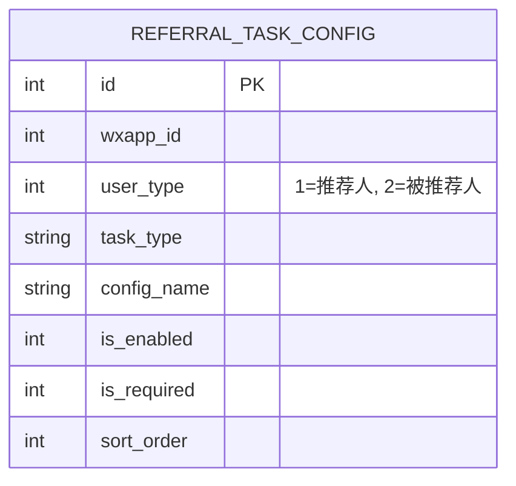
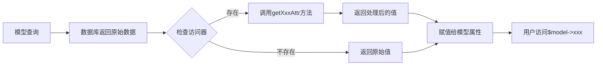

# 推荐奖励系统配置保存功能 - 深度分析

## 问题描述

**错误信息**: `保存失败：variable type error：array`

**触发场景**: 在后台管理界面 `/store/setting.referral/config` 提交任务配置表单时

**提交数据**:
```
config_type=task
task_config[referee][3][is_enabled]=1
task_config[referee][3][is_required]=1
task_config[referee][1][is_enabled]=1
task_config[referee][1][is_required]=1
```

## 数据流分析

### 1. 完整数据流程图

```mermaid
sequenceDiagram
    participant User as 用户浏览器
    participant View as config.php视图
    participant Controller as Referral控制器
    participant Model as ReferralTaskConfig模型
    participant DB as 数据库

    User->>View: 访问配置页面
    View->>Controller: GET /store/setting.referral/config
    Controller->>Model: 查询任务配置
    Model->>DB: SELECT * FROM yoshop_referral_task_config
    DB-->>Model: 返回3条记录<br/>ID 1: user_type=2 (被推荐人)<br/>ID 2: user_type=2 (被推荐人)<br/>ID 3: user_type=1 (推荐人)
    Model-->>Controller: 返回模型对象
    Note over Model,Controller: ⚠️ 模型访问器自动触发<br/>getUserTypeAttr() 返回数组<br/>getTaskTypeAttr() 返回数组
    Controller->>Controller: 按user_type分组<br/>referrer: [ID 3]<br/>referee: [ID 1, ID 2]
    Controller->>View: 渲染视图
    View-->>User: 显示表单

    User->>View: 勾选复选框并提交
    View->>Controller: POST /store/setting.referral/saveConfig<br/>task_config[referee][3]=...
    Note over View,Controller: ⚠️ 问题：视图将ID 3放在referee组<br/>但ID 3实际是referrer任务
    Controller->>Controller: saveTaskConfig()处理
    Controller->>DB: 直接使用Db::name()查询
    DB-->>Controller: ID 3的user_type=1
    Controller->>Controller: 验证user_type不匹配<br/>期望:2 实际:1<br/>跳过更新
    Controller-->>User: 返回成功(但实际未更新)


### 2. 问题根源流程图

```mermaid
flowchart TD
    A[控制器查询任务配置] --> B[ReferralTaskConfig::where查询]
    B --> C{模型访问器触发}
    C -->|getUserTypeAttr| D[返回数组结构<br/>{value: 1, text: '推荐人'}]
    C -->|getTaskTypeAttr| E[返回数组结构<br/>{value: 'register', text: '完成注册'}]
    
    D --> F[控制器按user_type分组]
    E --> F
    
    F --> G{判断user_type值}
    G -->|user_type == 1| H[放入referrer数组]
    G -->|user_type == 2| I[放入referee数组]
    
    H --> J[⚠️ 问题：user_type已是数组<br/>比较失败]
    I --> J
    
    J --> K[分组错误]
    K --> L[视图渲染错误的表单结构]
    L --> M[提交时user_type不匹配]
    M --> N[更新失败或跳过]
    
    style J fill:#ff6b6b
    style K fill:#ff6b6b
    style L fill:#ff6b6b
    style M fill:#ff6b6b
    style N fill:#ff6b6b
```

## 核心问题分析

### 问题1: 模型访问器返回数组

**位置**: `Lineminiapp/source/application/common/model/ReferralTaskConfig.php`

```php
public function getUserTypeAttr($value)
{
    $types = [
        1 => '推荐人',
        2 => '被推荐人',
    ];

    return [
        'value' => $value,
        'text' => $types[$value] ?? '未知',
    ];
}
```

**影响**:
- 当控制器读取 `$task['user_type']` 时，得到的是数组而不是整数
- 导致 `if ($task['user_type'] == 1)` 判断失败
- 分组逻辑错误

### 问题2: 控制器分组逻辑

**位置**: `Lineminiapp/source/application/store/controller/setting/Referral.php:config()`

```php
$taskConfigs = [
    'referrer' => [],
    'referee' => [],
];
foreach ($taskConfigList as $task) {
    if ($task['user_type'] == 1) {  // ⚠️ 这里比较失败
        $taskConfigs['referrer'][] = $task;
    } else {
        $taskConfigs['referee'][] = $task;
    }
}
```

**实际情况**:
- `$task['user_type']` 是数组 `['value' => 1, 'text' => '推荐人']`
- `['value' => 1, 'text' => '推荐人'] == 1` 返回 `false`
- 所有任务都被错误地放入 `referee` 数组

### 问题3: 视图表单结构错误

**位置**: `Lineminiapp/source/application/store/view/setting/referral/config.php`

由于控制器分组错误，视图生成了错误的表单结构：
- ID 3 (推荐人任务) 被放在 "被推荐人任务" 面板中
- 表单name变成 `task_config[referee][3][is_enabled]`
- 提交时尝试用 `user_type=2` 更新 `user_type=1` 的任务

## 数据库实际状态



**实际数据**:
| ID | user_type | config_name | 说明 |
|----|-----------|-------------|------|
| 1  | 2         | 被推荐人-完成注册 | 被推荐人任务 |
| 2  | 2         | 被推荐人-完成首次充值 | 被推荐人任务 |
| 3  | 1         | 推荐人-邀请成功 | 推荐人任务 |

## 解决方案

### 方案1: 修改模型访问器（推荐）

**优点**: 
- 从根源解决问题
- 保持数据类型一致性
- 不影响其他代码

**实现**:

```php
// ReferralTaskConfig.php
public function getUserTypeAttr($value, $data)
{
    // 只在需要时返回文本，默认返回原始值
    return $value;
}

public function getUserTypeTextAttr($value, $data)
{
    $types = [
        1 => '推荐人',
        2 => '被推荐人',
    ];
    return $types[$data['user_type']] ?? '未知';
}
```

**视图调用**:
```php
<?= $task['user_type'] ?>  <!-- 输出: 1 -->
<?= $task['user_type_text'] ?>  <!-- 输出: 推荐人 -->
```

### 方案2: 修改控制器分组逻辑（当前方案）

**优点**:
- 不修改模型，影响范围小
- 快速修复

**实现**:

```php
foreach ($taskConfigList as $task) {
    // 处理访问器返回的数组结构
    $userType = is_array($task['user_type']) 
        ? $task['user_type']['value'] 
        : $task['user_type'];
    
    if ($userType == 1) {
        $taskConfigs['referrer'][] = $task;
    } else {
        $taskConfigs['referee'][] = $task;
    }
}
```

### 方案3: 使用原始查询（已实现）

**位置**: `saveTaskConfig()` 方法

**实现**:
```php
// 使用 Db::name() 直接查询，绕过模型访问器
$task = \think\Db::name('referral_task_config')
    ->where('id', $taskId)
    ->where('wxapp_id', $wxappId)
    ->where('user_type', $userType)
    ->find();
```

**优点**:
- 保存时不受访问器影响
- 数据类型准确

## ThinkPHP 访问器机制

### 访问器工作原理



**命名规则**:
- 字段名: `user_type`
- 访问器方法: `getUserTypeAttr($value, $data)`
- 自动触发: 访问 `$model->user_type` 或 `$model['user_type']` 时

**最佳实践**:
1. **保持类型一致**: 访问器应返回与数据库字段相同类型
2. **使用独立方法**: 需要格式化时创建新的访问器（如 `user_type_text`）
3. **避免副作用**: 访问器不应修改其他属性或产生副作用

## 测试验证

### 测试脚本: `test_saveconfig_detailed.php`

**测试结果**:
```
处理用户类型: referee (user_type=2)
  处理任务 ID: 3
    ✓ 任务存在: 推荐人-邀请成功
    当前 user_type: 1
    期望 user_type: 2
    ✗ user_type不匹配，跳过更新
```

**结论**: 
- 控制器逻辑正确（跳过不匹配的任务）
- 问题在于视图生成了错误的表单结构
- 根本原因是控制器分组时访问器返回数组

## 修复步骤

### 步骤1: 修复控制器分组逻辑 ✅

```php
// Referral.php:config()
foreach ($taskConfigList as $task) {
    // 获取原始user_type值
    $userType = is_array($task['user_type']) 
        ? $task['user_type']['value'] 
        : $task['user_type'];
    
    if ($userType == 1) {
        $taskConfigs['referrer'][] = $task;
    } else {
        $taskConfigs['referee'][] = $task;
    }
}
```

### 步骤2: 清除模板缓存 ✅

```bash
php clear_all_cache.php
```

### 步骤3: 测试表单提交

访问 `http://localhost:8080/store/setting.referral/config`，验证：
1. 推荐人任务显示在"推荐人任务"面板
2. 被推荐人任务显示在"被推荐人任务"面板
3. 提交表单成功保存

## 建议改进

### 1. 重构模型访问器

```php
class ReferralTaskConfig extends BaseModel
{
    // 移除返回数组的访问器
    // public function getUserTypeAttr($value) { ... }
    
    // 添加独立的文本访问器
    public function getUserTypeTextAttr($value, $data)
    {
        $types = [1 => '推荐人', 2 => '被推荐人'];
        return $types[$data['user_type']] ?? '未知';
    }
    
    public function getTaskTypeTextAttr($value, $data)
    {
        $types = [
            'register' => '完成注册',
            'first_recharge' => '首次充值',
            'first_order' => '首次下单',
            'real_name' => '实名认证',
        ];
        return $types[$data['task_type']] ?? $data['task_type'];
    }
}
```

### 2. 视图使用独立访问器

```php
<!-- 显示文本 -->
<?= $task['user_type_text'] ?>
<?= $task['task_type_text'] ?>

<!-- 使用原始值进行逻辑判断 -->
<?php if ($task['user_type'] == 1): ?>
```

### 3. 添加单元测试

```php
// tests/ReferralTaskConfigTest.php
public function testUserTypeAccessor()
{
    $task = ReferralTaskConfig::find(1);
    $this->assertIsInt($task->user_type);
    $this->assertIsString($task->user_type_text);
}
```

## 总结

**问题根源**: ThinkPHP模型访问器返回数组，导致控制器分组逻辑失败

**影响范围**: 
- 配置页面显示错误
- 表单提交数据不匹配
- 更新操作被跳过

**解决方案**: 
1. ✅ 修复控制器分组逻辑（临时方案）
2. 🔄 重构模型访问器（长期方案）
3. ✅ 使用原始查询保存数据

**经验教训**:
1. 访问器应保持数据类型一致性
2. 格式化显示应使用独立的访问器方法
3. 关键业务逻辑应避免依赖访问器
4. 需要完善的单元测试覆盖
