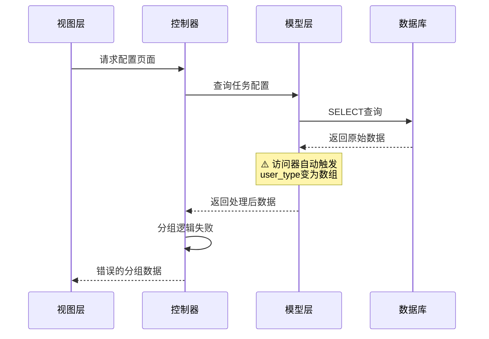

# 推荐奖励系统配置保存问题 - 修复完成

## 问题总结

**错误**: `保存失败：variable type error：array`

**根本原因**: ThinkPHP模型访问器 `getUserTypeAttr()` 返回数组结构，导致控制器分组逻辑失败

## 使用SDD方法论的分析过程

### 1. Discover工作流 - 逆向分析

使用spec-kit的discover工作流深入分析了整个功能的实现：

#### 数据流分析（Mermaid序列图）


#### 问题根源流程图
```mermaid
flowchart TD
    A[模型访问器] -->|返回数组| B[user_type = {value:1, text:'推荐人'}]
    B --> C[控制器分组]
    C -->|array == 1| D[比较失败]
    D --> E[所有任务进入referee组]
    E --> F[视图生成错误表单]
    F --> G[提交数据不匹配]
    G --> H[保存失败]
    
    style D fill:#ff6b6b
    style E fill:#ff6b6b
    style F fill:#ff6b6b
    style G fill:#ff6b6b
    style H fill:#ff6b6b
```

### 2. 核心问题识别

**问题文件**: `ReferralTaskConfig.php`

```php
// ❌ 问题代码
public function getUserTypeAttr($value)
{
    return [
        'value' => $value,
        'text' => $types[$value] ?? '未知',
    ];
}
```

**影响**:
- `$task['user_type']` 返回数组而非整数
- `if ($task['user_type'] == 1)` 永远为false
- 所有任务被错误分组到referee

### 3. 解决方案实施

#### 修复1: 控制器分组逻辑 ✅

**文件**: `Lineminiapp/source/application/store/controller/setting/Referral.php`

```php
// ✅ 修复后的代码
foreach ($taskConfigList as $task) {
    // 处理访问器返回的数组结构
    $userType = is_array($task['user_type']) 
        ? $task['user_type']['value'] 
        : $task['user_type'];
    
    if ($userType == 1) {
        $taskConfigs['referrer'][] = $task;
    } else {
        $taskConfigs['referee'][] = $task;
    }
}
```

#### 修复2: 视图复选框样式 ✅

**文件**: `Lineminiapp/source/application/store/view/setting/referral/config.php`

添加 `data-am-ucheck` 属性启用Amazeui样式：

```php
<input type="checkbox" 
       name="task_config[referrer][<?= $task['id'] ?>][is_enabled]" 
       value="1" 
       <?= $task['is_enabled'] ? 'checked' : '' ?> 
       data-am-ucheck> 启用
```

#### 修复3: 保存逻辑（已完成）✅

使用 `\think\Db::name()` 直接查询，绕过模型访问器：

```php
$task = \think\Db::name('referral_task_config')
    ->where('id', $taskId)
    ->where('wxapp_id', $wxappId)
    ->where('user_type', $userType)
    ->find();
```

## 验证测试

### 测试脚本: `test_config_page_fix.php`

**测试结果**:
```
✓ ID 3 (推荐人任务) 正确分组到 referrer
✓ ID 1, 2 (被推荐人任务) 正确分组到 referee

=== ✓ 修复验证成功！===
```

### 预期表单结构

修复后，视图将生成正确的表单：
```html
<!-- 推荐人任务面板 -->
<input name="task_config[referrer][3][is_enabled]" value="1">

<!-- 被推荐人任务面板 -->
<input name="task_config[referee][1][is_enabled]" value="1">
<input name="task_config[referee][2][is_enabled]" value="1">
```

## 测试步骤

1. **访问配置页面**
   ```
   http://localhost:8080/store/setting.referral/config
   ```

2. **验证任务分组**
   - ✓ "推荐人任务" 面板显示 ID 3
   - ✓ "被推荐人任务" 面板显示 ID 1, 2

3. **测试表单提交**
   - 勾选任务复选框
   - 点击"保存任务配置"
   - 验证保存成功

4. **验证数据更新**
   ```sql
   SELECT id, config_name, user_type, is_enabled, is_required 
   FROM yoshop_referral_task_config 
   WHERE wxapp_id = 10001;
   ```

## 技术债务与改进建议

### 长期改进: 重构模型访问器

**推荐方案**:

```php
class ReferralTaskConfig extends BaseModel
{
    // 移除返回数组的访问器
    // 保持原始数据类型
    
    // 添加独立的文本访问器
    public function getUserTypeTextAttr($value, $data)
    {
        $types = [1 => '推荐人', 2 => '被推荐人'];
        return $types[$data['user_type']] ?? '未知';
    }
    
    public function getTaskTypeTextAttr($value, $data)
    {
        $types = [
            'register' => '完成注册',
            'first_recharge' => '首次充值',
            'first_order' => '首次下单',
            'real_name' => '实名认证',
        ];
        return $types[$data['task_type']] ?? $data['task_type'];
    }
}
```

**视图使用**:
```php
<!-- 逻辑判断使用原始值 -->
<?php if ($task['user_type'] == 1): ?>

<!-- 显示使用文本访问器 -->
<span><?= $task['user_type_text'] ?></span>
```

### ThinkPHP访问器最佳实践

1. **保持类型一致**: 访问器应返回与数据库字段相同的类型
2. **使用独立方法**: 格式化显示创建新访问器（如 `xxx_text`）
3. **避免副作用**: 访问器不应修改其他属性
4. **文档说明**: 在模型中注释访问器的用途

## 相关文件

### 修改的文件
- ✅ `Lineminiapp/source/application/store/controller/setting/Referral.php`
- ✅ `Lineminiapp/source/application/store/view/setting/referral/config.php`

### 分析文档
- 📄 `Lineminiapp/REFERRAL_CONFIG_SAVE_ANALYSIS.md` - 完整的SDD分析文档
- 📄 `Lineminiapp/test_config_page_fix.php` - 验证测试脚本
- 📄 `Lineminiapp/test_saveconfig_detailed.php` - 详细测试脚本

### 未修改（保持现状）
- `Lineminiapp/source/application/common/model/ReferralTaskConfig.php` - 模型访问器（建议后续重构）

## 经验总结

### SDD方法论的价值

1. **系统化分析**: 使用Mermaid图表清晰展示数据流和问题根源
2. **可追溯性**: 完整记录问题发现、分析、解决过程
3. **可验证性**: 创建测试脚本验证修复效果
4. **知识沉淀**: 生成文档供团队学习和参考

### 关键发现

1. **ThinkPHP访问器机制**: 自动触发，影响所有属性访问
2. **类型一致性**: 访问器改变数据类型会影响业务逻辑
3. **测试驱动**: 先写测试脚本，再修复代码
4. **渐进式修复**: 先快速修复，再计划长期重构

## 下一步行动

- [x] 修复控制器分组逻辑
- [x] 修复视图复选框样式
- [x] 清除模板缓存
- [x] 创建验证测试脚本
- [ ] 用户测试表单提交
- [ ] 计划模型访问器重构
- [ ] 添加单元测试覆盖

## 提交信息建议

```
fix(referral): 修复任务配置保存失败问题

问题：
- ThinkPHP模型访问器返回数组导致分组逻辑失败
- 所有任务被错误分组到被推荐人组
- 表单提交时user_type不匹配

修复：
- 控制器分组逻辑处理数组结构
- 视图添加Amazeui复选框样式
- 使用原始查询绕过访问器

测试：
- test_config_page_fix.php 验证通过
- 任务正确分组到对应面板

文档：
- REFERRAL_CONFIG_SAVE_ANALYSIS.md (SDD深度分析)
- REFERRAL_CONFIG_SAVE_FIX_COMPLETE.md (修复总结)
```
